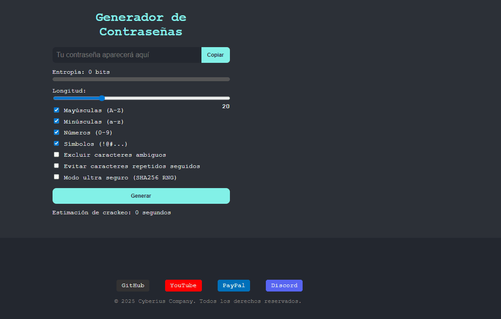

<p align="center">
  <a href="README.md">
    
    <strong>Español</strong>
  </a>
  &nbsp;|&nbsp;
  
  <strong>English</strong>
  &nbsp;|&nbsp;
  <a href="https://www.youtube.com/watch?v=xvFZjo5PgG0&list=RDxvFZjo5PgG0&start_radio=1&pp=ygUTcmljayByb2xsaW5nIG5vIGFkc6AHAQ%3D%3D">
    
    <strong>日本語</strong>
  </a>
</p>

# CyPasswordGenerator

This is a tool designed to create ultra-secure passwords, visually evaluated and ready for use in environments requiring maximum digital protection.

- GitHub Pages: https://cyberiuscompany.github.io/CyPasswordGenerator/

---

<p align="center">
  
</p>

---

## 🎥 Demonstration

<p align="center">
  
</p>

---

## Tool Screenshots

<h2 align="center">Image 1</h2>
<p align="center">
  
</p>

<h2 align="center">Image 2</h2>
<p align="center">
  
</p>

## 🚀 Main Features

- ✅ Secure random generation (optional SHA256 RNG)
- ✅ Real-time entropy evaluation
- ✅ Crack time estimation
- ✅ Visual metric radar: Length, Entropy, Variety, Brute Force, Crack Time
- ✅ Full customization:
  - Uppercase, lowercase, numbers, symbols
  - Exclude ambiguous characters
  - Avoid repeated characters
- ✅ One-click copy button

## 🧰 Technologies Used

- `HTML5` + `CSS3` (modern dark mode)
- Pure `JavaScript` (no dependencies)
- Entropy and strength calculated using cryptographic standards

## 📁 Project Structure

```bash
├── index.html 
├── script.js 
├── style.html 
```

---

## 📄 Additional Documentation

- [🤝 Code of Conduct](.github/CODE_OF_CONDUCT.md)
- [📬 Contributing](.github/CONTRIBUTING.md)
- [🔐 Security](.github/SECURITY.md)
- [⚠️ Legal Notice](DISCLAIMER.md)
- [📜 License](LICENSE)
- [📢 Support](.github/SUPPORT.md)

---

## ⚙️ 1.1 Installation and Usage

```bash
Open the index.html file in a web browser or double-click it.
GitHub Pages: https://cyberiuscompany.github.io/CyPasswordGenerator/
```
