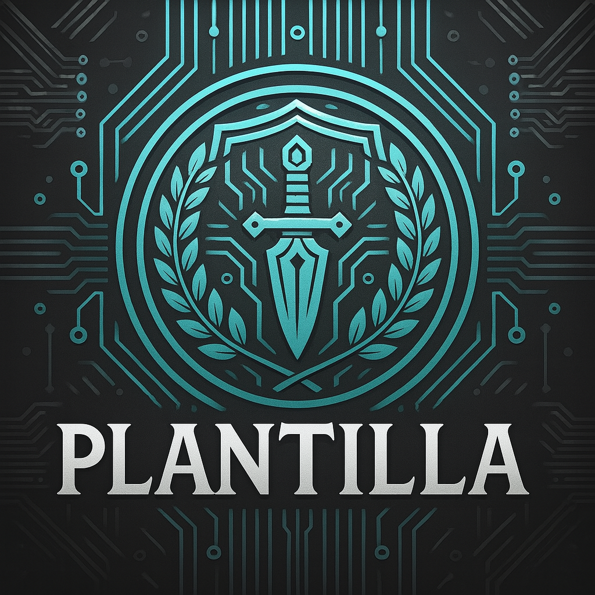

[](https://www.youtube.com/@CyberiusCompany)


# CyPasswordGenerator
Esta una herramienta pensada para crear contraseñas ultra seguras, visualmente evaluadas y listas para usar en entornos que requieren máxima protección digital.

- GitHub: https://cyberiuscompany.github.io/CyPasswordGenerator/
---

<p align="center">
  
</p

---

## 🎥 Demostración

<p align="center">
  
</p>

---

## Fotos de Herramienta

<h2 align="center">Foto 1</h2>
<p align="center">
  
</p>

<h2 align="center">Foto 2</h2>
<p align="center">
  
</p>

## 🚀 Funcionalidades principales

- ✅ Generación aleatoria segura (SHA256 RNG opcional)
- ✅ Evaluación de entropía en tiempo real
- ✅ Estimación del tiempo de crackeo (Crack Time)
- ✅ Radar de métricas visuales: Longitud, Entropía, Variedad, Fuerza Bruta y Crack Time
- ✅ Personalización completa:
  - Mayúsculas, minúsculas, números, símbolos
  - Exclusión de caracteres ambiguos
  - Evitar caracteres repetidos
- ✅ Botón para copiar con un clic

## 🧰 Tecnologías utilizadas

- `HTML5` + `CSS3` (Dark Mode moderno)
- `JavaScript` puro (sin dependencias)
- Cálculo de entropía y fuerza usando estándares criptográficos

## 📁 Estructura del proyecto

```bash
├── index.html 
├── script.js 
├── style.html 
```
---

## 📄 Documentación adicional

- [🤝 Código de Conducta](.github/CODE_OF_CONDUCT.md)
- [📬 Cómo contribuir](.github/CONTRIBUTING.md)
- [🔐 Seguridad](.github/SECURITY.md)
- [⚠️Aviso legal](DISCLAIMER.md)
- [📜 Licencia](LICENSE)
- [📢 Soporte](.github/SUPPORT.md)


---

## ⚙️ 1.1 Instalación y uso

```bash
Añadir el fichero index.html en una navegador Web o Clickearlo 2 veces.
GithubPages: https://cyberiuscompany.github.io/CyPasswordGenerator/
```

